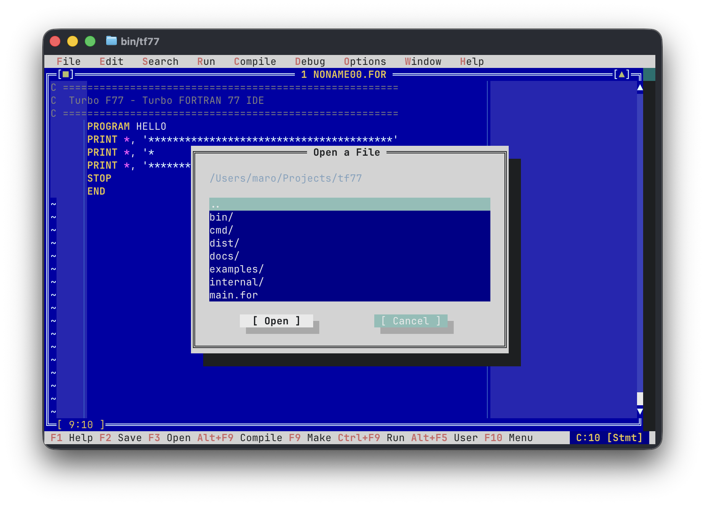

[한국어](./README.ko.md) | [English](./README.md)

# Turbo Fortran / Turbo F77

> **Retro Borland Turbo Vision TUI IDE for Modern and Classic Fortran**

**Turbo Fortran** delivers two self-contained Go binaries — `tf` (Modern Fortran / Free-Form) and `tf77` (Classic FORTRAN 77 / Fixed-Form) — faithfully recreating the legendary look, feel, and ergonomics of Borland's **Turbo Pascal** and **Turbo C** from the golden DOS era.

Built with `tcell`, both binaries share the iconic classic Turbo Blue canvas (`#0000A8`), double-line box frames (`╔═╗`), top pull-down menus, bottom status bar, `Alt+F5` User Screen, PC speaker sound effects, an interactive multi-backend debugger with a real-time Watches window, and smart multi-file build support powered by **gfortran** (1st priority) with automatic **Open Watcom 2.0** support when `$WATCOM` is configured.

---

<p align="center">
  
</p>

---

## Two Binaries, One Codebase

| Binary | Identity | Default File | Default Mode | Column Guides |
|:---|:---|:---|:---|:---|
| `bin/tf` | **Turbo Fortran** | `NONAME00.F90` | Free-Form (F90+) | Off |
| `bin/tf77` | **Turbo F77** | `NONAME00.FOR` | Fixed-Form (F77) | On (col 6, 72) |

Both binaries **auto-switch mode** based on the file extension whenever you open or save a file:
- **Fixed-Form** (`.for`, `.f`, `.f77`, `.ftn`, `.inc`): Columns 1-5 label, column 6 continuation, column 7+ statement, 72-column right guide active.
- **Free-Form** (`.f90`, `.f95`, `.f03`, `.f08`, `.f18`): No column restrictions, `!` comments at any position, column guides disabled, modern keyword and operator highlighting.

---

## Key Features

* **Authentic Borland Turbo Vision TUI**:
  * Classic Turbo Blue editor canvas (`#0000A8`) with double-line borders (`╔═╗`, `║ ║`, `╚═╝`)
  * 3D drop shadows and classic window headers (`[■] 1 NONAME00.F90 [▲]`)
  * Pull-down menu bar (`File`, `Edit`, `Search`, `Run`, `Compile`, `Debug`, `Options`, `Window`, `Help`)
  * Bottom hotkey bar with real-time column position indicator

* **Alt + Hotkey Direct Menu Navigation**:
  * Open any top menu instantly with `Alt+F` (File), `Alt+E` (Edit), `Alt+S` (Search), `Alt+R` (Run), `Alt+C` (Compile), `Alt+D` (Debug), `Alt+O` (Options), `Alt+W` (Window), `Alt+H` (Help)

* **Dual-Mode Syntax Highlighting**:
  * **F77 Fixed-Form**: Column-aware tokenizer (label, continuation, statement, inline comment). Keywords: `PROGRAM`, `SUBROUTINE`, `FUNCTION`, `DO`, `GOTO`, `COMMON`, `EQUIVALENCE`, etc.
  * **F90+ Free-Form**: Full modern keyword set: `module`, `use`, `contains`, `type`, `allocatable`, `intent`, `recursive`, `pure`, `elemental`, `select`, `cycle`, `exit`, `where`, `forall`, `interface`, `pointer`, `target`, etc.
  * Modern operators: `==`, `/=`, `<=`, `>=`, `=>`, `::` highlighted in magenta
  * Modern array and string intrinsics: `sum`, `matmul`, `size`, `shape`, `trim`, `allocated`, `associated`, etc.

* **FORTRAN 77 Column Guides (Fixed-Form only)**:
  * Subtle vertical guide lines (`│`, `#2E60C8`) at **Column 6** (Continuation) and **Column 72** (Statement limit)
  * Intelligent rendering: only visible on blank cells, never obscures code
  * Toggle via `Options → Column Guides: ON/OFF`

* **Smart Multi-File Compilation & Auto-Dependency Resolution**:
  * Automatically detects and compiles all companion source files (`.for`, `.f`, `.f77`, `.f90`, `.f95`, etc.) in the same folder
  * Filters out duplicate `PROGRAM` entry points; collects only subroutines, functions, and modules
  * gfortran builds isolate `.mod` files in a temporary directory (`-J <tmpDir>`) to prevent workspace pollution

* **Multi-Backend Interactive Debugger & Watches Window**:
  * **Default Engine (Internal F77)**: Built-in pure-Go interpreter engine for single-file routines (`hello.for`, `fibonacci.for`, `stats.for`) — zero external dependencies, sub-millisecond step execution, and 100% real-time variable/array inspection in the Watches window.
  * **Native Engine (LLDB / GDB / Open Watcom)**: Subprocess backend for compiling and debugging native binaries. Automatically used for **multi-file projects** (e.g. `main.for` with companion files `io_sub.for`, `math_sub.for`), linking all routines and enabling seamless cross-file breakpoints, file auto-switching, and stepping.
  * **Engine Toggle**: Switch engines anytime via `Debug ➔ Engine: Internal (F77) / Native (LLDB/GDB)`.
  * **Note on Apple LLDB (macOS) Watch Inspection**: Apple LLDB on macOS does not ship with a Fortran TypeSystem plugin (`frame variable` cannot decode Fortran types). When debugging multi-file projects via LLDB on macOS, cross-file breakpoints and stepping work seamlessly, but the Watches window and status bar will display an advisory note: `[Note: macOS LLDB has limited Fortran variable inspection support]`. On Linux/Windows, GDB inspects Fortran variables natively. For full variable inspection on macOS, single-file code runs via the built-in **Internal** engine.
  * **F4**: Toggle breakpoint (full-width red bar `●`)
  * **F5**: Start debugging / Continue to next breakpoint
  * **F7**: Trace Into, **F8**: Step Over, **Ctrl+F2**: Reset
  * Current execution pointer highlighted with a full-width yellow bar (`►`)
  * Bottom **Watches Window**: monitors variable names, types, and values in real time

* **Alt+F5 User Screen**:
  * Seamlessly toggle to a fullscreen console viewer to inspect program standard output and exit codes
  * Press any key to return to the IDE

* **Compiler Toolchain Integration**:
  * **Priority 1**: `gfortran` (Homebrew, system), `flang-new`, `flang`, `ifx`, `ifort`
  * **Priority 2** (when `$WATCOM` is set): `wfl386`, `wfc386`, `wfl`
  * Borland modal "Compiling..." statistics box (file, compiler, lines, errors, warnings, elapsed time)
  * Diagnostic parser supporting Open Watcom and standard Unix/GCC formats

* **Retro PC Speaker Sound Effects**:
  * Two-tone chime on success, buzz on errors, ping on debugger breakpoints
  * Toggle via `Options → Sound: ON/OFF`

---

## Keyboard Shortcuts

| Shortcut | Action | Description |
|:---|:---|:---|
| **Alt + F** | File Menu | Open File menu (`New`, `Open`, `Save`, `Exit`) |
| **Alt + E** | Edit Menu | Open Edit menu (`Undo`, `Cut`, `Copy`, `Paste`) |
| **Alt + S** | Search Menu | Open Search menu (`Find`, `Again`, `Go to Line`) |
| **Alt + R** | Run Menu | Open Run menu (`Run`, `User Screen`) |
| **Alt + C** | Compile Menu | Open Compile menu (`Compile`, `Make`) |
| **Alt + D** | Debug Menu | Open Debug menu (`Cont`, `Step`, `Trace`, `BP`) |
| **Alt + O** | Options Menu | Open Options menu (`Line Nums`, `Guides`, `Sound`) |
| **Alt + W** | Window Menu | Open Window menu (`Tile`, `Cascade`, `Close`) |
| **Alt + H** | Help Menu | Open Help menu (`About`) |
| **F1** | Help / About | Display IDE information and help |
| **F2** | Save | Save current buffer (or Save As if new) |
| **F3** | Open | Open file selection dialog |
| **F4** | **Breakpoint** | Toggle breakpoint on current line (`●`) |
| **F5** | **Debug / Continue** | Start debugging or continue execution |
| **F7** | **Trace Into** | Single step into subroutine/function |
| **F8** | **Step Over** | Step over current statement |
| **Ctrl + F2** | **Reset Debugger** | Reset and terminate active debug session |
| **Ctrl + F9** | **Run** | Build, execute, and view output in User Screen |
| **Alt + F9** | **Compile** | Compile target with "Compiling..." dialog |
| **F9** | Make | Build with companion modules |
| **Alt + F5** | **User Screen** | Toggle full-screen program output |
| **Ctrl + F** | **Find** | Search text in active buffer |
| **Ctrl + L** | **Search Again** | Repeat search for next match |
| **Alt + G** | **Go to Line** | Jump to line number |
| **Alt + L** | **Line Numbers** | Toggle line numbers |
| **F10** | Menu Bar | Focus top pull-down menu bar |
| **Alt + X** | Exit | Exit IDE |
| **Ctrl + Left / Right** | **Word Jump** | Move cursor word-by-word (macOS: **Option + Left / Right**) |
| **Shift + Arrows** | **Select Block** | Select text block (supports Ctrl/Option for word selection) |
| **Ctrl + C** / **Ctrl + Ins** | **Copy** | Copy selected text to clipboard |
| **Ctrl + X** / **Shift + Del** | **Cut** | Cut selected text to clipboard |
| **Ctrl + V** / **Shift + Ins** | **Paste** | Paste clipboard text |
| **Esc** | Close / Cancel | Dismiss modal dialog / clear selection |

> [!TIP]
> **macOS Terminal Option (Alt) Key Configuration**:
> On macOS, to ensure `Alt` key shortcuts (`Alt+F`, `Alt+X`, `Alt+F9`, `Alt+F5`, etc.) function properly, configure your terminal to **use the Option key as a Meta key**:
> - **macOS Terminal.app**: `Settings` ➔ `Profiles` ➔ `Keyboard` ➔ Check **"Use Option as Meta key"**
> - **iTerm2**: `Settings` ➔ `Profiles` ➔ `Keys` ➔ Set `Left/Right Option Key` to **"Esc+"**

---

## Build and Installation

### 1. Pre-built Binaries (GitHub Releases)

Download ready-to-use standalone executables (`tf` and `tf77`) for your platform from [GitHub Releases](https://github.com/MaroShim/TurboF77/releases):
* **macOS**: `tf77-v0.90.1-darwin-arm64.tar.gz` (Apple Silicon M-series)
* **Linux**: `tf77-v0.90.1-linux-amd64.tar.gz` (64-bit)
* **Windows**: `tf77-v0.90.1-windows-amd64.zip` (64-bit)

> [!NOTE]
> **Windows Defender / SmartScreen Notice**:
> Since these open-source binaries are newly compiled without expensive commercial code-signing certificates, Windows Defender or SmartScreen may occasionally flag them as unrecognized or a false positive.
> If a Windows SmartScreen popup appears, click **"More info" ➔ "Run anyway"** or add an exclusion to run safely. You can also build directly from source using the Go compiler below.

### 2. Prerequisites
* Go 1.20 or newer
* (Optional) `gfortran` (recommended), `flang`, or **Open Watcom 2.0** for compilation
* (Optional) `lldb` (macOS) or `gdb` (Linux) for native source-level debugging

### 3. Installation via Go (Recommended)

```bash
# Install Turbo F77 (Classic F77)
go install github.com/MaroShim/tf77/cmd/tf77@latest

# Install Turbo Fortran (Modern F90+)
go install github.com/MaroShim/tf77/cmd/tf@latest
```

Ensure `$GOPATH/bin` (or `~/go/bin`) is in your `$PATH`. You can then launch `tf77` or `tf` from anywhere:

```bash
tf77
# or
tf
```

### 4. Build from Source


```bash
# Build both binaries
go build -o bin/tf   ./cmd/tf
go build -o bin/tf77 ./cmd/tf77

# Launch Turbo Fortran (F90+ default mode)
./bin/tf

# Launch Turbo F77 (F77 fixed-form default mode)
./bin/tf77

# Open a specific file (auto-detects mode from extension)
./bin/tf  examples/modern_fibonacci.f90
./bin/tf77 examples/fibonacci.for
```

---

## Compiler Setup

### gfortran (Recommended — macOS / Linux)

```bash
# macOS (Homebrew)
brew install gfortran

# Ubuntu / Debian
sudo apt install gfortran
```

`tf` and `tf77` auto-detect `gfortran` and use it with `-g` debug symbols. On macOS, `lldb` is used as the native debugger automatically.

### Open Watcom 2.0 (Classic F77, when `$WATCOM` is set)

```bash
export WATCOM=/opt/watcom
export PATH=$WATCOM/binl64:$PATH
```

If `$WATCOM` is set, Open Watcom takes priority over other compilers. Without it, `gfortran` is always tried first.

---

## Example Projects

**Classic Fortran 77 (Fixed-Form)**
* `main.for`: Default starter template
* `examples/hello.for`: Classic Hello World
* `examples/fibonacci.for`: Fibonacci sequence generator
* `examples/stats.for`: Array statistics and RMS calculation
* `examples/modular/`: Multi-file modular program
  * `main.for`: Main entry point (`PROGRAM MODULAR`)
  * `math_sub.for`: Arithmetic function (`INTEGER FUNCTION CALCSUM`)
  * `io_sub.for`: Formatted output subroutine (`SUBROUTINE PRINTSUM`)

**Modern Fortran (Free-Form, F90+)**
* `examples/modern_fibonacci.f90`: Fibonacci using `ALLOCATABLE` array and modern `DO` loops
